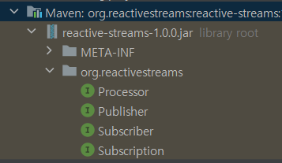

## 아주 간단한 비동기 프로그래밍 

- Reactive Streams 라이브러리를 사용하지 않음
- localhost:8080/sse - 1초에 1개 항목씩 총 5개 항목 프린트
- localhost:8080/add - 접근할 때마다 sse 페이지에 새로운 항목 하나씩 추가

*fluxtest 패키지*

[참고한 유튜브 링크] (https://www.youtube.com/watch?v=o6t2Q017J-s&list=PL93mKxaRDidFH5gRwkDX5pQxtp0iv3guf&index=6)

## Reactive Stream
- ### Publisher
  - subscribe(Subscriber subscriber) 구현 
    - Subscription 객체 생성
    - onSubscribe() 통해 Subscriber와 연결
  - Subscriber에게 데이터 제공하는 역할
- ### Subscriber
  - onSubscribe(Subscription s)
    - 구독을 시작하고 request()를 통해 데이터를 요청
  - onNext(T t)
    - 구독한 데이터(t) 받음 
  - onComplete
    - 구독한 데이터를 모두 받아 구독이 완료됐을 때 호출
  - onError
    - 문제 발생 시 호출
- ### Subscription
  - request(long n)
    - 데이터 요청 받았을 때 어떻게 응답줄 지 구현
    - 데이터를 n개씩 돌려줌
  - cancel()

*reactivetest 패키지*

**WebFlux** 
- 단일스레드, 비동기 + Stream을 통해 백프레셔가 적용된 데이터만큼 간헐적 응답이 가능
- 데이터 소비가 끝나면 응답이 종료

**SSE적용** (Servlet, WebFlux 모두에 적용 가능) 
- 데이터 소비가 끝나도 Stream 계속 유지

[참고한 유튜브 링크] (https://www.youtube.com/watch?v=6TiUCm3K_IE&list=PL93mKxaRDidFH5gRwkDX5pQxtp0iv3guf&index=5)